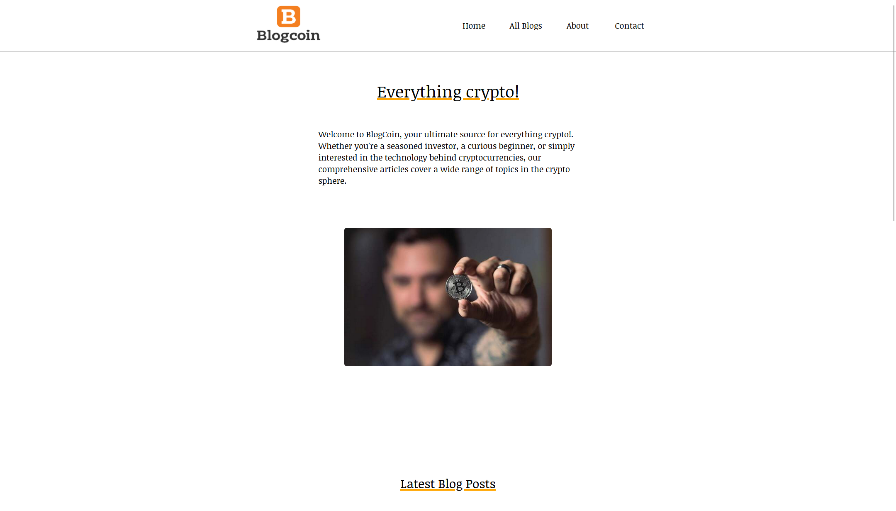

# Blogcoin - Project exam 1



## Description

Blogcoin is my submission for the project exam 1 that i had during my first year on noroff. For this exam we were tasked to create a blog site with different must have features for each page (listed below)

The website consists of these pages:

- index.html (home page that needed an functional carousel when clicked loads tbe next four blog posts )
- blogpost.html (Lists all blogposts and has a button that when clicked loads the next blogposts under the rest of th eposts)
- blogdetail.html (Displays images, titles and text from a specific blogpost. title is updatet accordingly)
- contact.html (a contact form, uses JS for validation)
- about.html(about page about blogcoins histpry)

## Built With

- [HTML 5](https://developer.mozilla.org/en-US/docs/Web/HTML)
- [CSS](https://developer.mozilla.org/en-US/docs/Web/CSS)
- [Javascript](https://developer.mozilla.org/en-US/docs/Web/CSS)
-[API](Hosted on wordpress through one.com)


## Getting Started

### Installing

1. Clone the repo:

```bash
git clone https://github.com/Noroff-FEU-Assignments/project-exam-1-Noroff-Anders.git
```

2. Install the dependencies:

No need to install any dependencies for this project. Project consists of only HTML, CSS and Javascript

### Running

Project is hosted on netlify:  https://fascinating-sunshine-9b1cbc.netlify.app/
When repo is cloned you can use liverserver extension to have the website hosted locally on your computer.

## Contributing

This is a school project so no contributions are accepted.

## Contact

- [ My LinkedIn page](https://www.linkedin.com/feed/)

- Email: anders.nes98@gmail.com

## Acknowledgments

[Noroff project modules](https://lms.noroff.no/my/)